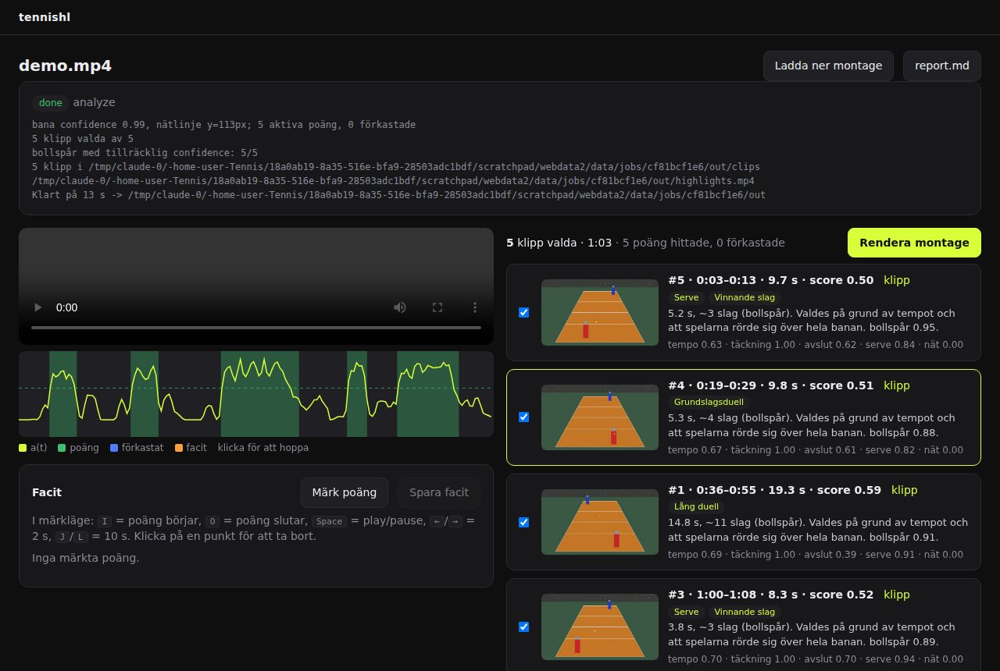
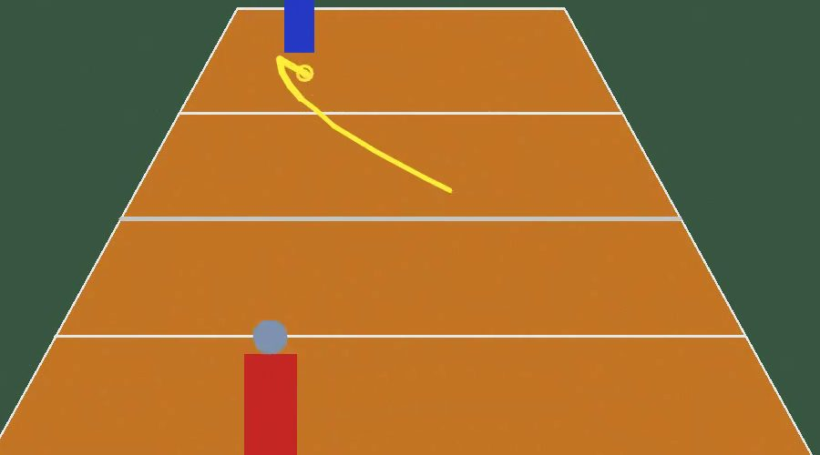
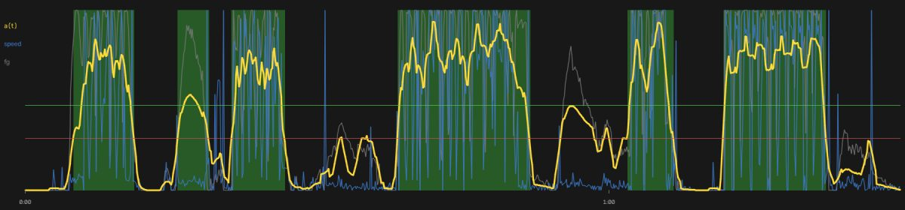

# tennishl - automatiska tennis-highlights

Lägg en iPhone på stativ bakom banan, filma hela matchen, mata in filen och
få tillbaka en highlight-video plus feedback om varje klipp. Ingen manuell
genomtittning av två timmar råfilm.

Det här repot innehåller:

| Del | Status |
|-----|--------|
| `tennishl serve` | **Lokal webapp.** Ladda upp, följ analysen, hoppa mellan poäng, bocka i/ur, rendera, märk facit, se recall/precision, justera trösklar och kör om utan att avkoda igen. |
| `tennishl/` | **Pipeline (Python).** Hela kedjan video -> poäng -> ranking -> klipp -> montage. |
| `tests/` | 52 tester: pipeline-logik på syntetiska signaler, end-to-end på syntetisk video, API och Playwright-test av UI:t. |
| `docs/` | Arkitektur, risker, milstolpar, TennisCut-jämförelse, hur man skaffar film, iOS-portningsplan. |

Default är TennisCuts kärnlöfte: **alla rallyn, dödtid bortklippt.** Topp-N
med ranking är ett tillval.

## Kom igång

```bash
python3 -m venv .venv && source .venv/bin/activate
pip install -e .            # numpy, opencv, fastapi, imageio-ffmpeg (statisk ffmpeg ingår)
tennishl serve              # http://127.0.0.1:8000
```

Webappen:

1. Släpp en videofil på sidan, eller skriv sökvägen till den (då kopieras
   inget). Välj "alla rallyn" eller "topp N". "Bara första N s" är för att
   testa trösklar snabbt på en lång match.
2. Följ analysen. När den är klar: videospelare, tidslinje med a(t) och alla
   hittade/förkastade segment, och ett kort per poäng med feedback. Klicka
   på ett kort så spelas exakt den poängen.
3. Bocka ur det du inte vill ha, "Rendera montage", ladda ner.
4. "Märk poäng": `I` och `O` på tangentbordet markerar var poäng börjar och
   slutar. Spara, och recall/precision/gränsfel mot detektionen visas, med
   klickbara missar och falska träffar.
5. "Justera trösklar och kör om": ändra, kör om på sekunder (observationerna
   är sparade, videon avkodas inte igen), se om siffrorna blir bättre.



Tester:

```bash
pytest -q -m "not slow"     # < 1 s
pytest -q                   # allt, inkl. syntetisk video, API och Playwright (~35 s)
```

Playwright-testet använder en installerad Chromium (`playwright install
chromium` om den saknas).

### Kommandoraden, samma pipeline

```bash
tennishl analyze match.mp4 -o match_out/
```

Efter körningen finns i `match_out/`:

| Fil | Vad |
|-----|-----|
| `highlights.mp4` | Färdigt montage av valda klipp (med fade in/ut, ljud bevarat). |
| `clips/NN_hXXX_SSSSSs.mp4` | Varje klipp separat, rankordning i filnamnet. Bollspår inritat när confidence räcker. |
| `report.md` | Tabell med tid, längd, score, kategori och en rad feedback per klipp. |
| `review.html` | Öppna i webbläsaren: tumnaglar, bocka i/ur klipp, ladda ner `selection.json`. |
| `selection.json` | Vilka klipp som ingår i montaget. Redigera för hand eller via review-sidan. |
| `highlights.json` | Allt om varje poäng: features, bidrag till score, bollpositioner, confidence. |
| `analysis.json` | Debug: banmodell, trösklar, aktivitetssignalen, alla förkastade segment med orsak. |

Ändra urvalet och rendera om (klipp som redan finns återanvänds, montaget
byggs på sekunder):

```bash
tennishl render match_out/
```

Bra flaggor:

```bash
tennishl retune out/ --config tuning.json                        # kör om utan att avkoda
tennishl eval out/ truth.json                                    # recall/precision mot facit
tennishl analyze match.mp4 -o out/ --top 8 --pre 1.5 --post 3   # färre klipp, annan marginal
tennishl analyze match.mp4 -o out/ --max-seconds 600             # testa på första 10 min
tennishl analyze match.mp4 -o out/ --no-ball                     # hoppa över bollspårning
tennishl analyze match.mp4 -o out/ --config tuning.json          # egna trösklar
tennishl debug match.mp4 -o out/debug/                           # signalplot + annoterad video
tennishl synth demo.mp4 --seconds 90                             # syntetisk testfilm
```

`tuning.json` är en partiell version av `Config` i `tennishl/config.py`, t.ex.
`{"segmentation": {"min_duration_s": 3.0}, "clip": {"max_highlights": 6}}`.

### Testa utan riktig film

```bash
tennishl synth demo.mp4 --seconds 90
tennishl analyze demo.mp4 -o demo_out/
open demo_out/review.html
```

Den syntetiska filmen är inte tennis, den är *det pipelinen ser*: statisk
bana, två spelarblobbar som rör sig snabbt under poäng och sakta mellan dem,
en liten ljus boll som flyger i bågar, sensorbrus. Facit hamnar i
`demo.truth.json`.

På den filmen hittar pipelinen 5 av 5 poäng inom ±1 s, räknar slagen ur
bollspåret rätt (11/11, 11/11, 3/3, 4/4) och producerar en falsk positiv
där spelarna joggar mellan två poäng (den hamnar sist i rankingen).



`tennishl debug` ger signalplotten som är första stället att titta när ett
klipp blev fel: gul = a(t), blå = spelarhastighet, grå = förgrund, grön/röd
linje = start-/stopptröskel, gröna fält = hittade poäng.



## Hur det fungerar (kort)

```
video --> proxy (480px, 10 fps) --> bakgrundsmodell --> rörelseblobbar per bild
ljud  --> 2-6 kHz-transienter --> bollslag med tidsstämpel
      --> banmodell (ROI + nätlinje ur fötternas histogram)
      --> aktivitetssignal a(t) = rörelsemängd + spelarhastighet + slagtäthet + "båda sidor"
      --> hysteres-tröskling --> rallysegment (+ förkastade med orsak)
      --> features per rally (längd, slag, tempo, täckning, avslut, serve-start)
      --> viktad score --> ranking --> kategorier
      --> bollspårning (960px, alla frames) bara i valda fönster
      --> klipp med marginal --> montage
```

Varje steg är en funktion på vanlig data, ingen delad state. Segmentering,
features och scoring är ren numpy utan OpenCV: de är testade på syntetiska
signaler och är det som portas rakt av till Swift.

Två designidéer bär det mesta. **Hastighet säger mer än rörelsemängd:**
att något rör sig på banan skiljer knappt rally från promenad, att någon
sprintar och byter riktning gör det. **Ljudet är oberoende av perspektiv:**
bortre spelaren är för liten för att synas pålitligt, men hans slag hörs.
Ett segment utan ett enda hörbart slag är ingen poäng, hur mycket någon
än springer.

Detaljer, val av heuristik kontra ML och riskerna: `docs/ARCHITECTURE.md`.

## Vad den kan och inte kan

Kan:
- Hitta när poäng börjar och slutar, klippa bort väntan, sidbyten, bollplock.
- Ranka poäng efter längd, tempo, slagfrekvens, täckning och avslut.
- Sätta ungefärliga etiketter: serve, vinnande slag, lång duell, snabbt utbyte, nätspel.
- Spåra bollen och rita spår när banan är stabil och bollen syns; annars avstå.
- Förklara varje val: alla siffror och trösklar finns i JSON.

Kan inte (än):
- Skilja forehand från backhand. Det kräver pose-estimering (`docs/ROADMAP.md`).
- Dubbel: spelarlogiken antar en spelare per planhalva.
- Kamera som panorerar eller zoomar. Kamerarörelse förkastar segmentet.
- Hjälpa till om bollen är mindre än ~6 px i 1080p (för långt bort).

Kalibrerad på en riktig match (17 min, stativ bakom baslinjen, hardcourt):
43 poäng, 10 av 10 kontrollrallyn hittade, bollspår i 31 poäng. Vad som
gick fel först och vad som ändrades står i `docs/CALIBRATION_LOG.md`. Det
som gav mest: **ljudet.** Slagen hörs även när bortre spelaren är fem
pixlar bred.


Utvecklingsmiljön når inte YouTube, så film måste hämtas på en vanlig
dator: `docs/GETTING_FOOTAGE.md`.

## Repo-layout

```
tennishl/
  config.py          alla trösklar, laddbara från JSON
  types.py           datastrukturer (även JSON-format)
  pipeline.py        orkestrering, progress, filer ut
  cli.py             kommandon
  synth.py           syntetisk testfilm
  video/             ffmpeg-wrapper, proxy-läsare
  analysis/
    observe.py       grovpass: bakgrundssubtraktion -> blobbar per bild
    court.py         ROI + nätlinje
    activity.py      a(t)
    audio.py         bollslag ur ljudspåret
    segmentation.py  rally in/ut (ren numpy)
    features.py      per rally
    scoring.py       score, kategorier, padding, merge
    ball.py          kandidater + temporal länkning
    signals.py       normalisering, peaks, utjämning
  render/
    clips.py         klippning, bollspår-overlay
    montage.py       concat
    review.py        rapport, review.html, tumnaglar
    debug.py         signalplot, debugvideo
  web/
    app.py           FastAPI-routes
    jobs.py          jobbkö, persistens, preview för HEVC
    static/          index.html, app.js, style.css (inga beroenden)
  eval.py            facit vs detektion
tests/
docs/
```
