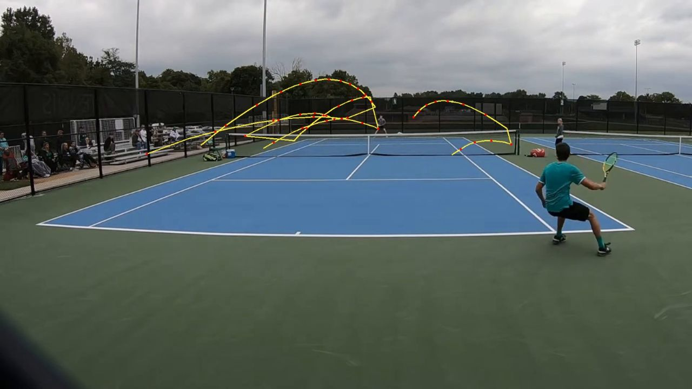

# Kalibreringslogg

Vad riktig film lärde oss, i den ordning det hände. Varje post: vad vi
såg, varför, vad vi ändrade, vad det gav.

## Film 1: Y-43vDIyiwI (17:16, 1080p30, hardcourt, mulet)

Kamera på stativ i hörnet bakom baslinjen, vidvinkel. Närspelaren blir
enorm när han går mot kameran, bortre spelaren är ~14x5 px i 480-proxyn.
Åskådare bakom staketet till vänster. Grannbanor hörs.

### Körning 1: syntetiskt kalibrerade trösklar

**1 poäng godkänd av 66 kandidater.** 58 förkastade som
`players_not_on_both_sides`.

Orsak: min-arean för spelarblobbar (0.06 % av bilden) var satt för två
lika stora spelare, som i synth. Bortre spelaren låg under. Utan bortre
spelare föll nätlinjen tillbaka till ROI-mitten, mitt i närspelaren, som
då klövs i "huvud = nära" och "ben = bortre". Det var det enda som gav
`spread = 1`.

Ändring: per-sida min-area (0.06 % nära, 0.008 % bortre), sida avgörs av
boxens underkant (fötterna) istället för centroid, nätlinjen ur fötternas
histogram med viktning så att små blobbar räknas.

### Körning 2: perspektivmedveten spelardetektion

**34 poäng, 389 s.** 19 förkastade på `players_not_on_both_sides`, ett
45-sekunderssegment förkastat som `too_long`.

Jämförelse mot ljudet (slagtransienter, oberoende detektor): 7 av 10
ljud-rallyn hittade. Tre missade, alla med bortre spelaren osynlig. Sju
videosegment utan ljud-rally, varav ett granskat bild för bild: spelaren
går och hämtar en boll i 12 s medan bortre står stilla. Falsk positiv.

Slutsats: "spelare på båda sidor" är svag på riktig film. Bortre spelaren
är för liten för att synas pålitligt, men hans slag hörs.

Ändring: ljudkanal. 2-6 kHz-energi vid 100 Hz, minus löpande median,
toppar över 7 robusta sigma räknat på de positiva värdena (median och MAD
på hela signalen kollapsar till 0 eftersom hälften av ramarna är exakt 0).
Slagtäthet in i a(t) med vikt 0.30. Segment utan ett enda slag förkastas.
Slagräkning från ljudet. `too_long` delas i djupaste aktivitetsdalen
istället för att förkastas.

Tröskelvalet, mätt i fyra kända fönster:

| k | tröskel | slag totalt | rally 14-20 s | promenad 25-37 s | dödtid 81-99 s |
|---|---------|-------------|---------------|------------------|----------------|
| 5 | 3.39 | 521 | 12 | 5 | 2 |
| 6 | 3.96 | 365 | 9 | 1 | 1 |
| **7** | **4.54** | **244** | **7** | **0** | **0** |
| 8 | 5.12 | 168 | 5 | 0 | 0 |

### Körning 3: med ljud

**43 poäng, 355 s.** 10 av 10 ljud-rallyn hittade, promenaden borta.
Förkastade: 11 `too_short`, 9 `no_ball_hits`, 1 `camera_moved`.

Granskning av de korta segmenten (3-8 s): fyra riktiga korta poäng (serve
plus returmiss), ett falskt: **studsar före serven**. Bollen mot marken
låter som ett slag. Ligger 1.6 s före poängen, så `merge_gap_s` höjdes
till 2.5 s: studsarna dras in i poängen, som i TennisCut. Riktiga poäng
ligger aldrig närmare varandra än ~5 s.

Bugg hittad: alla klipp fick "Nätspel". Bortre planhalvan är 20 px hög i
proxyn, så bortre spelarens centroid är alltid "vid nätet". Nätspel mäts
nu bara på närspelarens fötter, relativt närmre halvans djup.

Gränser: starter 0-2 s tidiga (backtracking tar med uppkastet, bra),
slut 2-4 s sena (spelaren joggar ut ur bilden, aktiviteten faller
långsamt). TennisCuts recensioner klagar på det motsatta.

### Körning 4: bollspår

36 klipp, 31 av 43 poäng fick spår över tröskeln. Stickprov i ett långt
rally: tre av fyra spår rimliga bollbanor, **ett följde spelarens rygg**
(hackig L-form). Två orsaker:

1. Närspelaren nära kameran är större än max-arean, kastades i grovpasset
   och fick därför ingen exkluderingsbox i bollpasset. Hans kropp blev
   bollkandidater.
2. Confidence vägde längd och täckning lika tungt som jämnhet. En kedja
   längs en kropp är lång och tät.

Ändring: grovpasset behåller blobbar upp till 50 % av bilden (bara
`select_players` begränsar spelare till 6 %), exkluderingsboxar för alla
blobbar över bortre-golvet, confidence = 0.25 längd + 0.55 jämnhet + 0.20
täckning, tröskel 0.65.

Efter: rallyt 201-224 s ger 131 punkter, residual 0.16 px, varje slag en
ren parabel över nätet. Ett spår i 111-113 s visade sig vara bollen som
studsar ut längs sidlinjen efter poängen, tre studsar synliga. Riktigt,
men inte spel.

### Körning 5: bollspårets konsistens

Klagomål efter granskning av klippen: spåret tappas ofta. Mätt på ett
23-sekundersrally, per bildruta:

| | frames med kandidat | frames täckta av behållna kedjor |
|---|---|---|
| med spelarmask (körning 4) | 25 % | 13 % |
| utan spelarmask | 73 % | 19 % |

**Maskningen från körning 4 åt upp två tredjedelar av bollen.** Bollen är
framför, bakom eller bredvid en spelare sett från kameran under stora
delar av ett rally. Men att bara ta bort masken ger kroppsspårning igen.

Upplösningssvep på samma fönster (täckning / andel punkter på spelare / rms):

| | kandidater | kedjor | täckning | på spelare | rms |
|---|---|---|---|---|---|
| mask, 960 | 25 % | 7 | 13 % | 0 % | 0.16 |
| fri, 960 | 73 % | 8 | 19 % | 33 % | 1.06 |
| fri, 1280 | 90 % | 21 | 55 % | 61 % | 3.03 |
| fri, 1920 | 98 % | 41 | 94 % | 78 % | 6.05 |

94 % täckning vid 1920 är falsk: vi spårar kroppar. Men tabellen innehåller
lösningen. **En flygande boll anpassar sig till en lokal andragradskurva
med 0,09-0,30 px residual; en kedja längs en kropp ligger på 1,1-6,0.**
En hel storleksordning isär, alltså räcker ett fast tak för att separera
dem, och då vågar vi släppa på både masken och upplösningen.

Ändringar:
- Kandidater på spelare **flaggas** i stället för att kastas. En kedja får
  aldrig *starta* på en spelare och får inte bestå av mer än 40 % sådana
  punkter, men bollen får flyga förbi en kropp.
- `max_rms_px` som hård grind (0,9 px vid 960), inte bara en mjuk vikt.
- Bollpasset till 1280 px. Alla px-trösklar uttrycks vid referensbredd 960
  och skalas automatiskt, så upplösningen kan ändras utan att röra resten.
- Luckor i spåret sys ihop när bollens egen parabel förklarar hålet.
  Första försöket extrapolerade linjärt och missade med ~100 px över
  0,3 s (gravitationen böjer banan) - ett testfall fångade det.
  Kvadratisk extrapolation i stället. Ljudet är en andra, oberoende spärr:
  hörs ett racket i luckan är det en riktig riktningsändring.

Resultat på tre rallyn: täckningen gick från 13 % till 26 %, och de flesta
kvarvarande luckor innehåller ljudslag, alltså legitima riktningsändringar.

**Fysisk gräns, hittad på köpet.** En lucka på 6,6 s med 7 slag i visade
sig vara ett parti där bollen spelas högt mot ljusgrå himmel och trädkanten.
98 % av rutorna där har kandidater, men bara 38 % har någon *utanför* en
spelarbox: bollen syns helt enkelt inte mot den fonden. Ingen justering av
trösklar hjälper - ett svep på `diff_threshold` (14/10/7/5) var rent brus.
Det kräver en detektor som känner igen bollen på utseende, inte bara på
rörelse (TrackNet-liknande nät), eller en kamera med kortare slutartid.

### Körning 6: två mätfel, inga tröskelfel

Båda de kvarvarande punkterna på listan visade sig vara fel i *hur* vi
mätte, inte i var trösklarna låg.

**Nätspel sattes på 12 av 35 poäng.** Fördelningen av `net_approach` var
tvåtoppig — 15 poäng på exakt 0,0, sedan ett hopp till 0,55–0,99 — så
tröskeln 0,5 låg i tomrummet och var alltså rätt. Orsaken var att vi tog
*närmaste bildruta*. Bakgrundsmodellen delar ibland närspelaren så att
bara överkroppen detekteras, och då hamnar "fötterna" mitt på banan. En
enda sådan ruta räckte för att etikettera en grundslagsduell som nätspel.
Nu används tionde percentilen: hur nära han kom *konsekvent*. Etiketten
föll till 1 av 36.

**Segmenten slutade i median 1,9 s efter sista hörbara slaget**, med
utstickare upp till 7,5 s — spelarna joggar tillbaka medan aktiviteten
faller långsamt. Nu kapas slutet vid sista slaget + 0,8 s, och `post_roll`
lägger på eftersnacket medvetet i stället för av misstag. Svansen blev
0,8 s median, 1,8 s max.

Första versionen av kapningen **raderade sex poäng**: den kortade
segmenten under `min_duration_s` så att de förkastades som `too_short`.
Alla sex hade exakt ett hört slag, så de var sannolikt servefel snarare
än poäng — men de försvann av fel anledning. Kapningen är en förfining av
slutpunkten och ska inte avgöra om en poäng existerar. Med ett golv vid
`min_duration_s` blev det 36 poäng i stället för 30, med svansen kvar.

Om vi vill sålla bort servefel ska det vara ett uttalat krav på antal
slag, inte en bieffekt av längdkontrollen.

### Kvar att verifiera

- Ett komplett facit. Ljud-rallyn är en andra åsikt, inte sanning.
- Serve-etiketten: `serve_onset` bygger på stillhet före segmentet, men
  studsarna före serven ger nu aktivitet. Troligen behöver den räknas
  från första slaget istället.
- Bollspår vid bortre baslinjen: bollen är ~3 px där, troligen inget spår.
  Acceptabelt.

## Film 2: GlL6XyTbhLA (TennisCut-promo, 1:25)

Inte en match. Använd för UI-referens, se REFERENCE_VIDEO.md.

## Film 3: match2.MOV (61:36, 1080p60 HEVC 10-bit HLG, egen inspelning)

Grus/asfalt, sol lågt i väster, klarblå himmel. Kameran står **lågt och i
ett hörn**, en trädstam skymmer högerkanten, nedre halvan av bilden är tom
mark, och fladdrande lövskuggor rör sig över hela underlaget. Två spelare.

Viktigast för tolkningen: **det här är bollträning, inte en match.** De
slår långa sammanhängande serier utan poäng. Segment på 22-44 s är alltså
korrekta, och 54 % speltid är rimligt (mot 37 % i film 1).

### Vad 60 fps avslöjade

Tre grindar räknas i bildrutor och var inställda vid 30 fps:
`max_speed_px_per_frame` (bollen rör sig halva sträckan mellan rutor vid
60 fps, så grinden var dubbelt för lös), samt `max_gap_frames`,
`min_track_points` och `full_length_points` (som alla täckte halva den tid
de var avsedda för). De skalas nu mot `reference_fps` precis som
px-värdena skalas mot `reference_width`.

HDR-avkodningen (HLG, bt2020, 10-bitars) ger normala ljusnivåer i OpenCV
och ställde inte till något. Himlen är dock utbränd till 255, vilket är
den bakgrund bollen är svårast mot.

### Ljudet fick inte bära ensamt

Sex av 33 ljudserier (>=4 slag, <2,5 s isär) saknade helt motsvarande
videosegment. Mätt i de fönstren:

| fönster | a(t) | fg | hastighet | båda sidor | ljud |
|---|---|---|---|---|---|
| missad 44-49 | 0,33 | 0,09 | 0,18 | 0,20 | 0,70 |
| missad 54-58 | 0,43 | 0,05 | 0,39 | 0,12 | 1,00 |
| missad 284-292 | 0,26 | 0,01 | 0,00 | 0,00 | 0,65 |
| hittad 71-114 | 0,60 | 0,64 | 0,36 | 0,84 | 0,69 |

Spelarna var långt från kameran och syntes knappt som förgrund, medan
slagen hördes perfekt. Felet är strukturellt, inte en tröskel: med vikten
0,30 i ett viktat medelvärde kan ljudet ensamt nå högst 0,30, under
starttröskeln 0,52. En tyst kanal kunde alltså veta en säker.

Kanalerna är oberoende detektorer av samma händelse, så de ska kombineras
som union, inte medelvärde. `a(t) = max(viktat medel, ljudevidens)`.

Efter: missade ljudserier 6/33 -> 1/33, segment utan ljudstöd 5 -> 3.
Båda felriktningarna förbättrades samtidigt, alltså ingen avvägning.

### Kvar att titta på

- Lövskuggorna ger `fg` median 0,37 mot ~0,20 i film 1. Percentil-
  normaliseringen fångar upp det, men fg bidrar mest brus här.
- Tre segment saknar fortfarande ljudstöd. Kan vara korta serier med
  färre än fyra slag, kan vara falska.
- Vad "highlight" betyder i en träningssession är en produktfråga: långa
  rallyn är normen snarare än undantaget, så rankingen mäter något annat
  än i en match.
